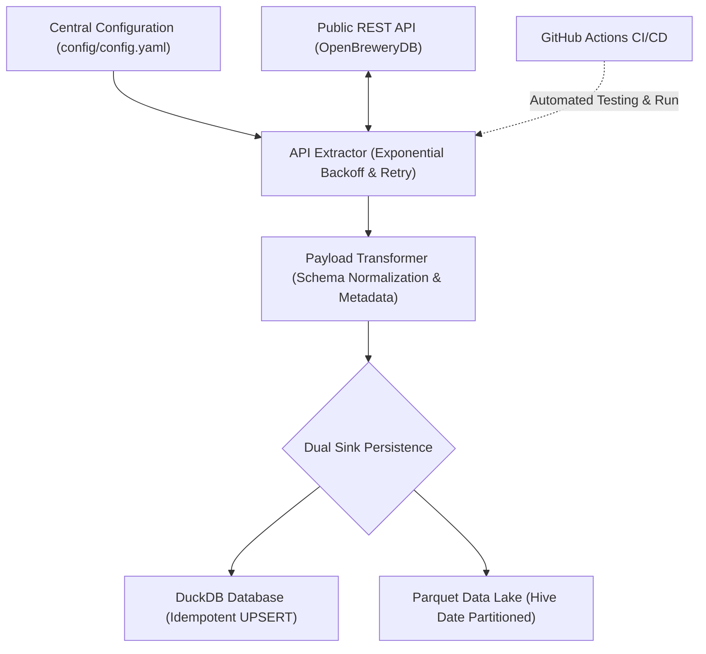

# Automated Data Lakehouse Ingestion Pipeline

[](https://www.python.org/)
[](https://duckdb.org/)
[](https://parquet.apache.org/)
[]()

An enterprise-grade, resilient, environment-agnostic **Data Lakehouse Ingestion Engine** built in Python. The pipeline extracts raw JSON payloads from public REST APIs with automated exponential backoff and retry handling, normalizes data into structured Pandas DataFrames, and dual-persists records into an **idempotent DuckDB database** and a **Hive-partitioned Parquet Data Lake**.

---

## 🏗️ Pipeline Architecture



---

## ✨ Key Features

- **🛡️ Resilient HTTP Extraction**: Automated HTTP request retries with configurable exponential backoff strategies, handling transient 4xx/5xx network failures cleanly.
- **⚡ Dual Sink Persistence**:
  - **DuckDB**: Fast SQL analytical engine with idempotent `ON CONFLICT (id) DO UPDATE` (UPSERT) logic to prevent record duplication across repeated ingestion runs.
  - **Parquet Data Lake**: Hive-style UTC date partitioning (`data/lake/year=YYYY/month=MM/day=DD/batch_<timestamp>.parquet`) with PyArrow engine and native DuckDB fallback.
- **⚙️ Centralized Configuration Manager**: Environment-agnostic YAML configuration (`config/config.yaml`) with optional CLI argument override precedence.
- **📊 Schema Enforcement & Sanitization**: Type casting, coordinate conversion, white-space stripping, missing column filling, and ISO 8601 UTC ingestion timestamp tracking.
- **🧪 Comprehensive Unit Test Suite**: `unittest` test suite covering extraction, transformation, idempotent loading, config fallback, and parquet partitioning.

---

## 📁 Repository Structure

```text
api-ingestor/
├── config/
│   └── config.yaml          # Centralized pipeline configuration defaults
├── data/
│   ├── ingested_data.duckdb # DuckDB analytical database file
│   └── lake/                # Hive-partitioned Parquet data lake
│       └── year=YYYY/month=MM/day=DD/
├── src/
│   ├── config.py            # YAML configuration loader & dataclasses
│   ├── extract.py           # API Extractor with HTTP retries & backoff
│   ├── transform.py         # Payload transformer & schema normalizer
│   └── load.py              # Dual sink loader (DuckDB UPSERT & Parquet Lake)
├── tests/
│   └── test_pipeline.py     # Unit test suite
├── main.py                  # CLI entrypoint & pipeline orchestrator
├── requirements.txt         # Project Python dependencies
└── README.md                # Technical documentation
```

---

## 🚀 Quick Start & Local Setup

### Prerequisites

- Python **3.10+** (Python 3.14 recommended)
- `pip` package manager

### 1. Clone & Set Up Environment

```bash
# Clone the repository
git clone https://github.com/vardaanbazaz/api-ingestor.git
cd api-ingestor

# Create and activate virtual environment
python3 -m venv .venv
source .venv/bin/activate  # On Windows: .venv\Scripts\activate
```

### 2. Install Dependencies

```bash
pip install -r requirements.txt
```

### 3. Execute the Ingestion Pipeline

Run the pipeline using the default settings configured in `config/config.yaml`:

```bash
python main.py
```

Run with custom CLI overrides (CLI flags take precedence over YAML defaults):

```bash
python main.py --max-pages 2 --per-page 50 --log-level DEBUG
```

---

## ⚙️ Configuration Reference

Defaults are defined in [`config/config.yaml`](config/config.yaml):

```yaml
api:
  url: "https://api.openbrewerydb.org/v1/breweries"
  default_per_page: 50
  max_retries: 3
  timeout: 10

storage:
  duckdb_path: "data/ingested_data.duckdb"
  lake_dir: "data/lake"
```

### CLI Override Flags

| Flag            | Type    | Description                                                     | Default Fallback                |
| :-------------- | :------ | :-------------------------------------------------------------- | :------------------------------ |
| `--config`    | `str` | Path to YAML configuration file                                 | `config/config.yaml`          |
| `--api-url`   | `str` | Endpoint URL of target REST API                                 | `config.api.url`              |
| `--max-pages` | `int` | Maximum pages to extract                                        | `None` (Fetches all pages)    |
| `--per-page`  | `int` | Number of items per page                                        | `config.api.default_per_page` |
| `--db-path`   | `str` | Target DuckDB database file path                                | `config.storage.duckdb_path`  |
| `--lake-dir`  | `str` | Parquet Data Lake root directory                                | `config.storage.lake_dir`     |
| `--log-level` | `str` | Logging verbosity (`DEBUG`, `INFO`, `WARNING`, `ERROR`) | `INFO`                        |

---

## 🧪 Running Unit Tests

Execute the automated test suite to verify pipeline functionality:

```bash
python -m unittest discover -s tests -p "test_*.py" -v
```

---

## 🔍 Querying the Dual Sinks

### Querying DuckDB Database

```python
import duckdb

conn = duckdb.connect("data/ingested_data.duckdb")
df = conn.execute("SELECT count(*), count(DISTINCT id) FROM breweries").df()
print(df)
conn.close()
```

### Querying Parquet Data Lake via DuckDB SQL

```python
import duckdb

conn = duckdb.connect()
df = conn.execute("SELECT * FROM 'data/lake/year=*/*/*/*.parquet' LIMIT 10").df()
print(df)
conn.close()
```
